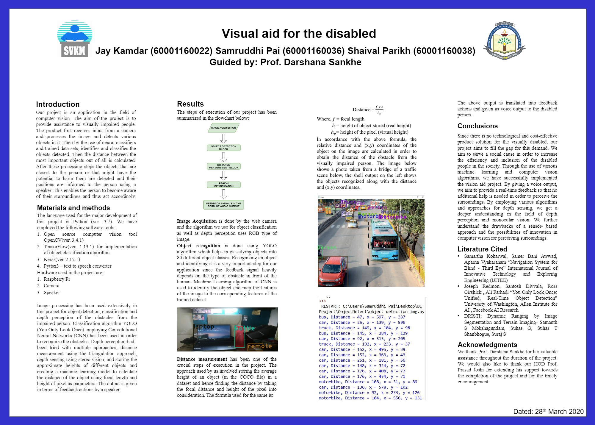

# Aid-for-Visually-Impaired-People
Project code for the project Aid for Visually Impaired People

Used YOLO to detect objects

Experimented on both binocular vision and monocular vision as input to detect objects and calculate the distance between user and the objects

